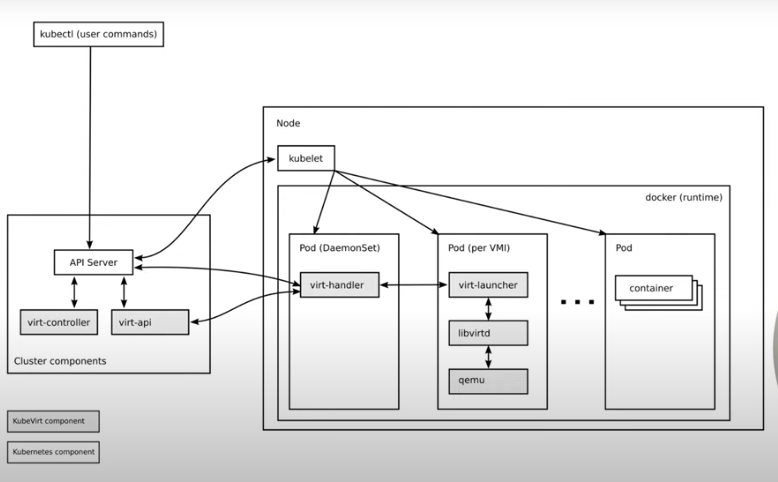
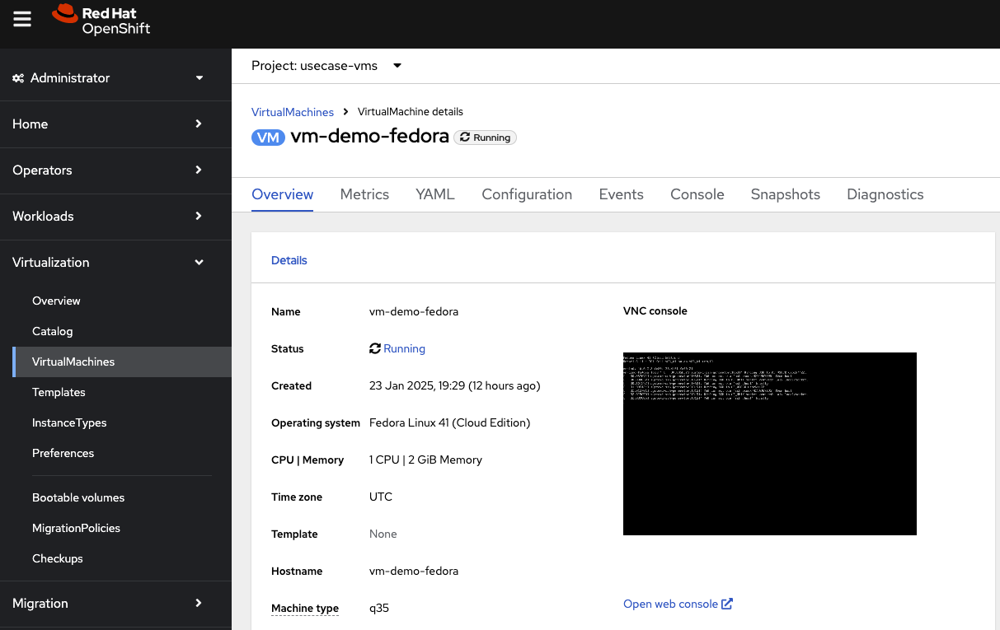
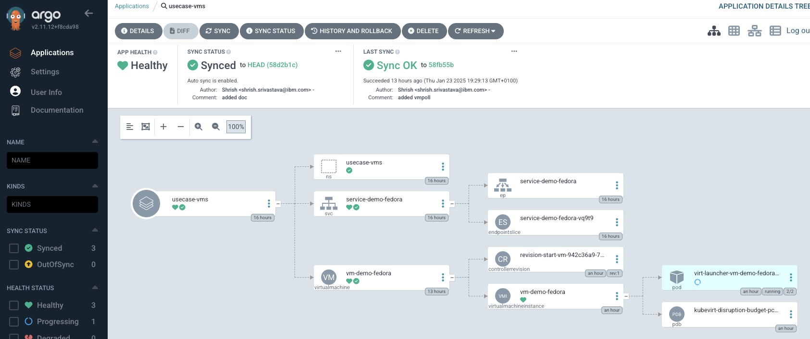
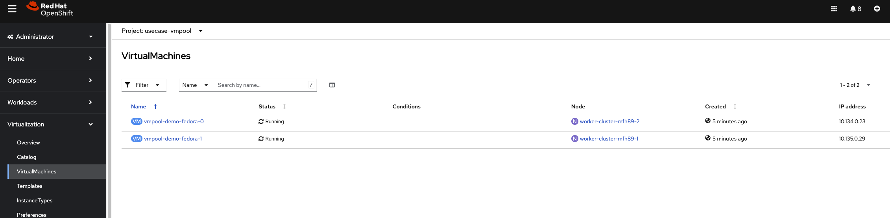
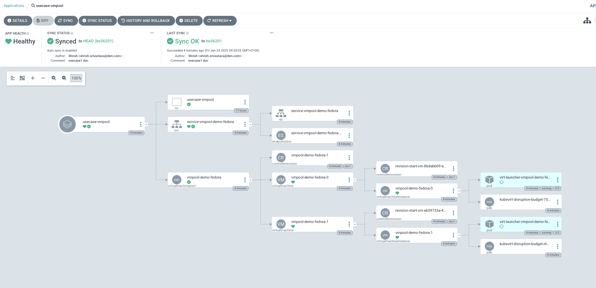
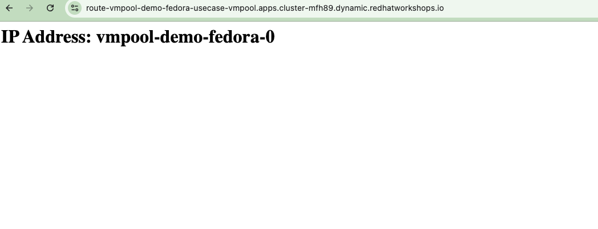
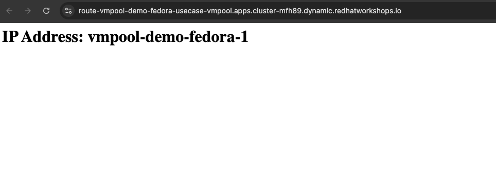
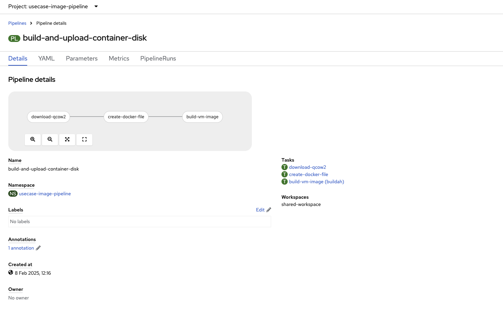
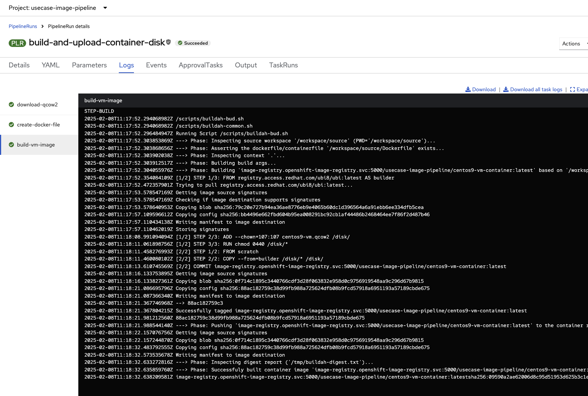

# oVirt Documentation

Purpose of this document is to provide the demo script of different usecases to showcase Openshift Virtualization using GitOps.

|===
| Section | Subsection | Description

| xref:#architecture[Architecture]
| 
| Overview of the architecture with a diagram.

| Usecases for demonstration 
| xref:#usecase-1-provision-a-vm-from-the-template-using-gitops[UseCase 1: Provision a VM from the template using GitOps]
| Steps to provision a VM from a template using GitOps, including verification and cleanup.

| 
| xref:#usecase-2-provision-a-vmpool-to-create-mutiple-instance-of-vm-using-gitops[UseCase 2: Provision a VMPool to create multiple instances of VM using GitOps]
| Steps to provision a VMPool to create multiple VM instances using GitOps, including verification and cleanup.

| 
| xref:#usecase-3-create-a-vm-image-and-push-it-top-openshift-registry-via-pipeline[UseCase 3: Create a VM image and push it to Openshift registry via pipeline]
| Steps to create a VM image and push it to the Openshift registry using a pipeline, including verification.

|===

## Architecture

## Usecases for demonstartion   

### **UseCase 1**: Provision a VM from the template using GitOps.

* Ensure following path(path: vms) is defined in the gitops/virt-usecase-appset.yaml file.

[source,yaml]
generators:
- git:
    repoURL: https://github.com/shrishs/ovirt.git
    revision: HEAD
    directories:
        - path: vms

* Onboard the gitops repo and create application set.

[source,shell]
oc apply -k gitops
secret/repo-hub-configuration-auth configured
applicationset.argoproj.io/virt-usecase-appset configured

* This would create a arogcd applicationset & application in openshift-gitops namespace.

[source,shell]
oc get applicationset virt-usecase-appset -n openshift-gitops
NAME                  AGE
virt-usecase-appset   16h

[source,shell]
oc get application -n openshift-gitops -l type
NAME          SYNC STATUS   HEALTH STATUS
usecase-vms   Synced        Healthy

* Above application would create a VM from the template in usecase-vms namespace and expose the VM using route.
[source,shell]
oc get vm -n usecase-vms
NAME             AGE   STATUS    READY
vm-demo-fedora   12h   Running   True

[source,shell]
oc get pods -n usecase-vms
NAME                                 READY   STATUS    RESTARTS   AGE
virt-launcher-vm-demo-fedora-8jm2p   2/2     Running   0          94m

* This can also be verified using the Openshift console.

* This can also be verified using the argocd console.

* get the route for the VM created.

[source,shell]
oc get route -n usecase-vms
NAME                HOST/PORT                                                                     PATH   SERVICES              PORT   TERMINATION     WILDCARD
route-demo-fedora   route-demo-fedora-usecase-vms.apps.cluster-workshop.io          service-demo-fedora   80     edge/Redirect   None

* Test the above route 
[source,shell]
curl -k https://route-demo-fedora-usecase-vms.apps.cluster-workshop.io
<html><body><h1>IP Address: vm-demo-fedora</h1></body></html>

* Delete all the resources created for the usecase.

[source,shell]
oc delete applicationset virt-usecase-appset -n openshift-gitops
applicationset.argoproj.io "virt-usecase-appset" deleted

### **UseCase 2**: Provision a VMPool to create mutiple instance of VM using GitOps.

* Ensure following path(path: vms) is defined in the gitops/virt-usecase-appset.yaml file.

[source,yaml]
generators:
- git:
    repoURL: https://github.com/shrishs/ovirt.git
    revision: HEAD
    directories:
        - path: vmpool

* Onboard the gitops repo and create application set.

[source,shell]
oc apply -k gitops
secret/repo-hub-configuration-auth configured
applicationset.argoproj.io/virt-usecase-appset configured

* This would create a arogcd applicationset & application in openshift-gitops namespace.

[source,shell]
oc get applicationset virt-usecase-appset -n openshift-gitops
NAME                  AGE
virt-usecase-appset   16h

[source,shell]
oc get application -n openshift-gitops -l type
NAME             SYNC STATUS   HEALTH STATUS
usecase-vmpool   Synced        Healthy

* Above application would create a VM from the template in usecase-vmpool namespace and expose the VM using route.
[source,shell]
oc get vm -n usecase-vmpool
NAME                   AGE   STATUS    READY
vmpool-demo-fedora-0   63s   Running   True
vmpool-demo-fedora-1   63s   Running   True

[source,shell]
oc get pods -n usecase-vmpool
NAME                                       READY   STATUS    RESTARTS   AGE
virt-launcher-vmpool-demo-fedora-0-jv82d   2/2     Running   0          107s
virt-launcher-vmpool-demo-fedora-1-b5z6r   2/2     Running   0          107s

* This can also be verified using the Openshift console.

* This can also be verified using the argocd console.

* get the route for the VM created.

[source,shell]
oc get route -n usecase-vmpool
NAME                       HOST/PORT                                                                               PATH   SERVICES                     PORT   TERMINATION     WILDCARD
route-vmpool-demo-fedora   route-vmpool-demo-fedora-usecase-vmpool.apps.cluster-workshop.io          service-vmpool-demo-fedora   80     edge/Redirect   None

* Test the above route ,open the above url in a browser. 

* Test the above route ,open the above url in a new cognito window. 

* Increase the number of replicas in the vmpool/vmpool-demo-fedora.yaml file and commit the changes to the gitops repo.

[source,yaml]
apiVersion: pool.kubevirt.io/v1alpha1
kind: VirtualMachinePool
metadata:
  name: vmpool-demo-fedora
  annotations:
    description: VM example
  labels:
    app: vmpool
    os.template.kubevirt.io/fedora: 'true'
spec:
  replicas: 3

[source,shell]
oc get pods -n usecase-vmpool
NAME                                       READY   STATUS    RESTARTS   AGE
virt-launcher-vmpool-demo-fedora-0-jv82d   2/2     Running   0          22m
virt-launcher-vmpool-demo-fedora-1-b5z6r   2/2     Running   0          22m
virt-launcher-vmpool-demo-fedora-2-xd2f2   2/2     Running   0          2m16s

* Test the above route ,open the above url in a new cognito window. Sometime one has to try several time to get different Hostname.

image::img/usecase-vmpool-route-3.png[]

* Delete all the resources created for the usecase.

[source,shell]
oc delete applicationset virt-usecase-appset -n openshift-gitops
applicationset.argoproj.io "virt-usecase-appset" deleted

### **UseCase 3**: Create a vm image and push it top openshift registry via pipeline

* **Prerequisite** :Openshitf pipline is installed in the cluster.

* Create a pipeline which downloads centos image and use buildah to push the image to openshift regsitry

[source,shell]
oc apply -k pipeline
namespace/usecase-image-pipeline created
rolebinding.rbac.authorization.k8s.io/system:image-builder created
rolebinding.rbac.authorization.k8s.io/system:openshift:scc:privileged created
persistentvolumeclaim/pipeline-pvc created
pipeline.tekton.dev/build-and-upload-container-disk created
task.tekton.dev/create-docker-file created
task.tekton.dev/download-qcow2 created

* Create a pipeline run to execute the pipeline.

[source,shell]
oc apply -f pipeline/pipelinerun.yaml
pipelinerun.tekton.dev/build-and-upload-container-disk created
bash-3.2$ oc apply -f pipeline/vm-demo-centos.yaml
virtualmachine.kubevirt.io/vm-demo-centos created

* Verify the image is pushed to the openshift registry.

[source,shell]
oc get imagestream
NAME                   IMAGE REPOSITORY                                                                               TAGS     UPDATED
centos9-vm-container   image-registry.openshift-image-registry.svc:5000/usecase-image-pipeline/centos9-vm-container   latest   10 minutes ago

* Use the above image and create the VM.

[source,shell]
oc apply -f pipeline/vm-demo-centos.yaml
virtualmachine.kubevirt.io/vm-demo-centos created

* Verify the VM is created.

[source,shell]
oc get vm
NAME             AGE   STATUS    READY
vm-demo-centos   11m   Running   True
bash-3.2$ 